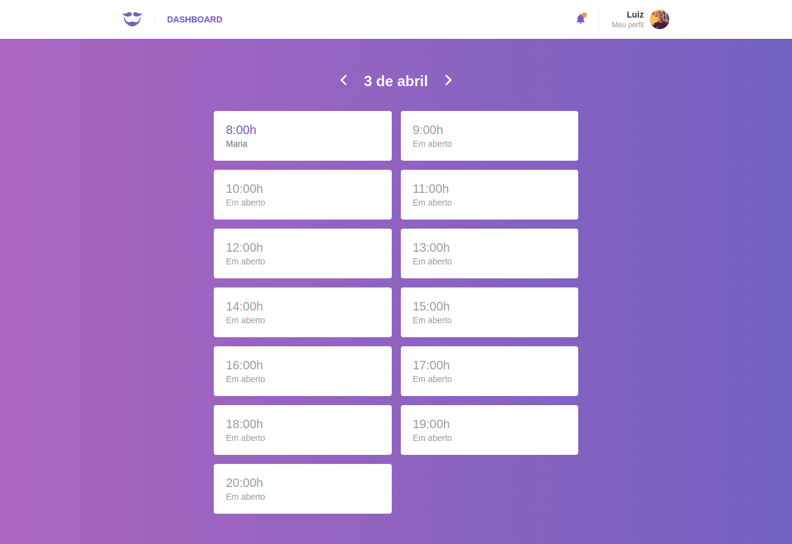
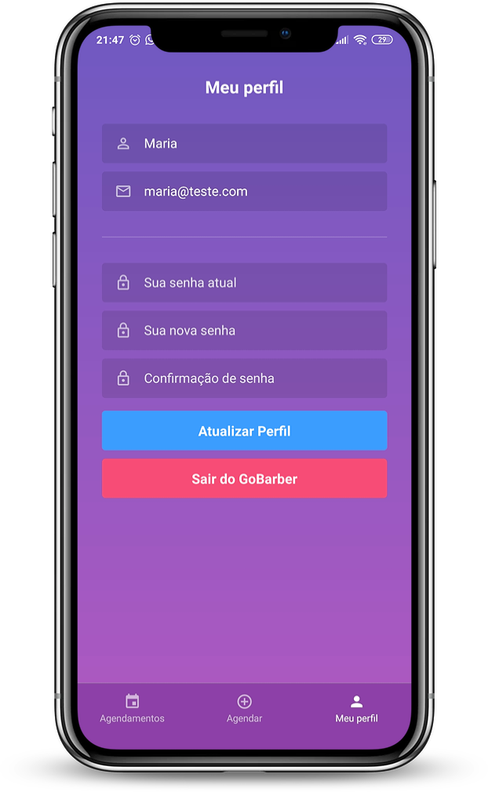
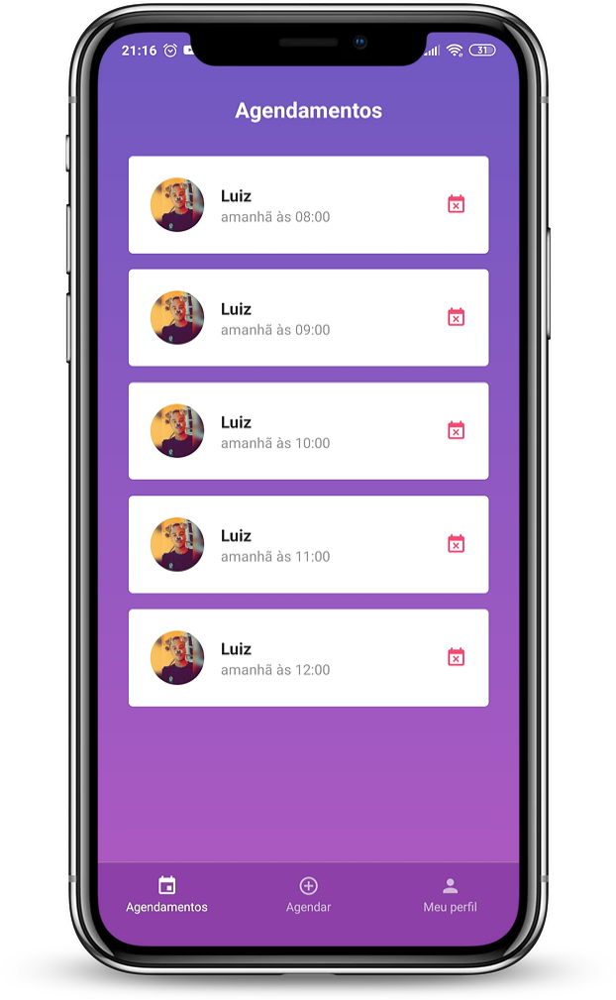

<h1 align="center">
  

  GoBarber
</h1>

<h1 align="center">
  
</h1>

<h1 align="center">
  
    
</h1>

## 📜 Sobre
Este é um projeto de um serviço de agendamento para profissionais de beleza, que une o prestador de serviço ao consumidor. Construído com as tecnologias mais populares, este repositório contem uma API REST como backend, uma aplicação em ReactJS como frontend e um app mobile em React Native.

A aplicação em ReactJS são para os pret

### 🔽 Requisitos
1. Ter o **NodeJs** e o **Yarn** instalado
2. Ter instâncias do **Redis**, **PostgreSQL** e **MongoDB** em execução
3. Um dispositivo ou emulador **Android** conectado ao computador

### :rocket: Começando
``1. git clone https://github.com/GustavoBlaze/gobarber.git``
``2. cd gobarber``

### :rocket: Iniciando o backend
``1. cd backend``
``2. yarn``
``3. yarn dev``

### 💻 Iniciando com o Front-end 
``1. cd frontend``
``2. yarn``
``3. yarn start``

### 📱Iniciando com o Mobile (Apenas Android)
``1. cd mobile``
``2. yarn``
``3. adb reverse tcp:3333 tcp:3333``
``4. react-native start``
``5. react-native run-android``

### 🧰  Ferramentas utilizadas
- ⚛️ **ReactJs** - Biblioteca Javascript para criar interfaces de usuário.
- ⚛️ **React Native** - Framework para criar apps nativos usando React.
- 💅 **Styled Components** - Biblioteca Javascript pra estilizar componentes.
- 🔁 **Redux** - Biblioteca JavaScript de código aberto para gerenciar o estado do aplicativo.
- 🔂 **Redux Saga** - Biblioteca Javascript que torna os efeitos colaterais do aplicativo mais faceis de gerenciar.
